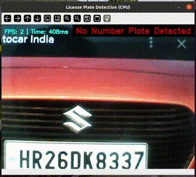

# 🔍 Number Plate Detection and Extraction 

This project demonstrates **number plate detection and extraction** using a **quantized TFLite model**  with **TensorFlow Lite** and **OpenCV**.

Designed for cross-platform use (Linux, Windows, embedded boards like NXP i.MX8M Plus), it supports **hardware acceleration** via delegates like **NPU or GPU**.

---



---

## 📁 Project Structure

```
.
├── main.py                           # Your main script (e.g., video inference)
├── livcam_demo.py                    # detection and extraction script for live camera inference
├── quant_model_NPU_3k.tflite         # Quantized TFLite model 
├── labelmap.txt                      # Label mapping (class index to name)  
├── demo.mp4                          # video used in the script 
├── README.md                         # This documentation
```

---

## 🧠 Model Information

- **Model**: Number plate Detection Model (Quantized)  
- **Format**: TensorFlow Lite (`.tflite`)  

✅ Optimized for edge devices  
🧠 Compatible with NPU delegate (`libvx_delegate.so`) on platforms like i.MX8MP

---

## ✅ Dependencies

Install with:

```bash
apt install tesseract-ocr
pip install opencv-python tflite-runtime pytesseract
```

### Requirements:
- Python 3.6+
- OpenCV – for video stream processing and display
- TFLite Runtime – for inference
- Tesseract OCR Engine - the actual OCR engine(installed via apt)
- Pytesseract - python wrapper for Tesseract

### 🔎 Note  
The `opencv-python` package automatically installs the latest version of **NumPy** that is compatible with your Python version.  
However, this program (or one of its dependencies) requires **NumPy version 1.x**, because modules compiled against NumPy 1.x may crash when used with NumPy 2.x or later.

To fix this issue, downgrade NumPy by running:  
```bash
pip install "numpy<2.0"
```
---

## 🚀 How to Run

### 1️⃣ Using a video file:

```bash
python main.py
```
> ✅ Ensure `libvx_delegate.so` exists on your device.If the delegate .so is missing, script will raise an error and stop.

### 2️⃣ Using a video file:

```bash
python livcam_demo.py
```
> ✅ Ensure `libvx_delegate.so` exists on your device.If the delegate .so is missing, script will raise an error and stop.

---

## 📝 Label Mapping (`labelmap.txt`)

This file maps class indices to human-readable labels:

```text
   license
```

> 🔁 Ensure these labels correspond exactly to the classes your .tflite model was trained on, so that predictions map correctly to meaningful names.

---

## 🎯 Output

- 🏷️ Detected license plate region(s) with bounding boxes and confidence scores drawn on video frames
- 🔠 Recognized license plate text overlaid on the video in real time (top-right corner of the frame)
- 🔊 Spoken output of new, valid license plate numbers using espeak + aplay
- 📤 Console log messages showing detected and recognized license plate strings

### 📟 Console Output Example

```text
[OCR] Plate: TN10AB1234
```

### 🖼️ Display

- A window titled "Detection + OCR" shows the video with predicted class label and confidence score
- The latest detected license plate shown at the top-right
- Press **`q`** to quit.

---

## ⚙️ Internal Processing Flow

1. Initialize video source (camera or file)
2. Load TFLite classification model (with or without delegate) 
3. Start OCR worker thread for asynchronous text recognition
4. Capture frame from video source
5. Preprocess frame (convert BGR to RGB, resize to model input size)
6. Run detection inference on the preprocessed frame
7. Preprocess each frame:
   - Extract bounding boxes, class indices, and confidence scores 
   - Filter detections by confidence threshold 
8. Extract license plate regions (ROIs) from the frame and enqueue for OCR
9. OCR worker preprocesses ROIs, runs Tesseract OCR, cleans and validates plate text
10. Display annotated frame with bounding boxes, labels, and last detected plate text
11. Repeat until exit

---

## 💡 Tips

- ✅ Use **quantized models (uint8)** for better hardware compatibility
- 🚀 For NXP i.MX8MP, use **`libvx_delegate.so`** to run on the NPU
- 📏 Adjust input size/resolution to balance accuracy and performance
