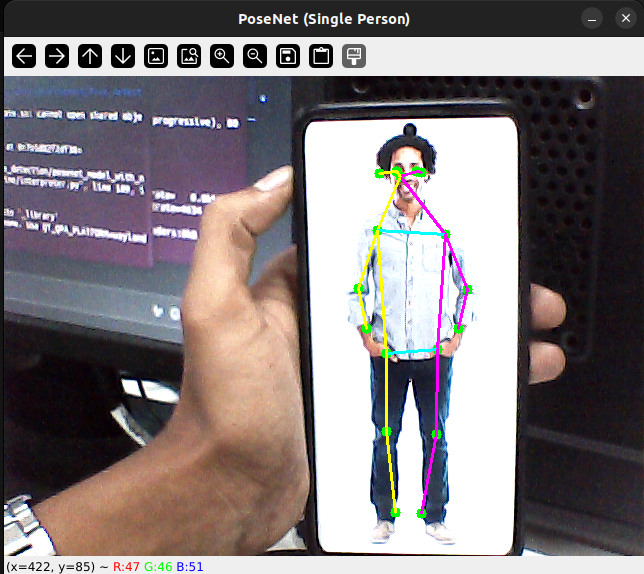

# PoseNet Single-Person Inference with NPU Delegate on Phycore-imx8m plus (Python)
 
This project demonstrates how to run google-corel [project - PoseNet](https://github.com/google-coral/project-posenet)  on a phycore-imx8m plus  using the TensorFlow Lite Runtime. It attempts to load an NPU delegate if available, falling back to CPU inference otherwise. After inference, it uses DBSCAN clustering to select and render keypoints belonging to the main (highest‐confidence) person in the frame.
 
---



---
 
## Table of Contents
 
- [Prerequisites](#prerequisites)  
- [Installation](#installation)  
- [Project Structure](#project-structure)  
- [Usage](#usage)  
---
 
## Prerequisites
 
1. **Operating System**  
   - Ubuntu 20.04 or newer (tested on Ubuntu 22.04 with Python 3.11).  
2. **Python Version**  
   - Python 3.8+ (3.10 or 3.11 recommended).  
3. **Camera**  
   - A webcam (USB or built‐in) recognized by OpenCV.  
4. **Hardware Accelerator (Optional)**  
   - An NPU  delegate library (`libvx_delegate.so`) installed in `/usr/lib/` or Facematch BSP of imx8m plsu rootfs.  
 
---
 
## Installation
 
   ```
 
1. **Create a Python virtual environment (recommended)**
 
   ```bash
   python3 -m venv venv
   source venv/bin/activate
   ```

 
2. **Install Python dependencies**
 
   ```bash
   pip install --upgrade pip
   pip install \
     numpy \
     opencv-python \
     tflite-runtime \
     scikit-learn
   ```
 
   * **`tflite-runtime`**: Provides the minimal TFLite interpreter without the full TensorFlow dependency.
   * **`opencv-python`**: for video stream processing
   * **`scikit-learn`**: Required for DBSCAN clustering and `StandardScaler`.
 
3. **Place the PoseNet model file**
   Ensure the quantized PoseNet model is saved as:
 
   ```text
   models/posenet_mobilenet_v1_075_353_481_quant.tflite
   ```
 
   (You can download a prebuilt TFLite quantized PoseNet from the (https://github.com/google-coral/project-posenet/tree/master/models/mobilenet/components).)
 
4. **verify NPU delegate**
 
   * NPU delegate library (e.g., `libvx_delegate.so`), place it under `/usr/lib/`.
   * Otherwise, inference will automatically fall back to CPU.
 
---
 
## Project Structure
 
```
.
├── pose.py                                           # Main script (e.g., live camera inference)
├── posenet_mobilenet_v1_075_353_481_quant.tflite     # Quantized TFLite model

```
 
* **`models/posenet_mobilenet_v1_075_353_481_quant.tflite`**
  Quantized MobileNet V1 PoseNet TensorFlow Lite model.
* **`pose.py`**
  Python script that:
 
  1. Loads the TFLite model (with optional NPU delegate).
  2. Captures frames from a webcam.
  3. Runs pose estimation (heatmaps + offsets).
  4. Decodes keypoint locations & confidence scores.
  5. Uses DBSCAN to select the main person.
  6. Draws keypoints & skeleton on the video feed.
 
---
 
## Usage
 
1. **Activate your virtual environment (if not already)**
 
   ```bash
   source venv/bin/activate
   ```
 
2. **Run the inference script**
 
   ```bash
   python3 test3.py
   ```
 
   * The script will attempt to load the NPU delegate library (`/usr/lib/libvx_delegate.so`).
   * If the delegate fails to load, it prints a warning and falls back to CPU.
   * A window titled **“PoseNet (Single Person)”** will open showing the webcam feed with drawn keypoints & skeleton.
   * Press **`q`** in the display window to exit and close the camera.
 
3. **Adjust parameters (optional)**
 
   * Inside `test3.py`, you can modify:
 
     * `min_score` in `select_main_person(...)` (default 0.4)
     * `threshold` in `draw_prediction_on_image(...)` (default 0.3)
     * DBSCAN parameters: `eps` and `min_samples` for clustering.
 
---
 
 
##  Loading the TFLite Model (with NPU Delegate)
 
```python
NPU_DELEGATE_PATH = "/usr/lib/libvx_delegate.so"
try:
    delegate = tflite.load_delegate(NPU_DELEGATE_PATH)
    interpreter = tflite.Interpreter(
        model_path=model_path, experimental_delegates=[delegate]
    )
    print("Running on NPU")
except Exception as e:
    print(f"Failed to load NPU delegate: {e}")
    print("Falling back to CPU execution.")
    interpreter = tflite.Interpreter(model_path=model_path)
interpreter.allocate_tensors()
input_details = interpreter.get_input_details()
output_details = interpreter.get_output_details()
```
 
* Attempts to load an NPU delegate library.
* If successful, inference will run on the accelerator.
* Otherwise, interpreter runs on the CPU.
 

 
> **Enjoy experimenting with PoseNet & NPU acceleration!**
