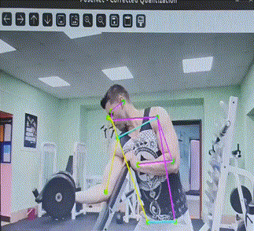

# Pose-Estimation Multi-Person Inference with NPU Delegate on Phycore-imx8m plus (Python)
 
This project demonstrates how to run mobilenet_v2 (pose-estimation)  on a phycore-imx8m plus  using the TensorFlow Lite Runtime. It attempts to load an NPU delegate if available, falling back to CPU inference otherwise. 
 
---



---
 
## Table of Contents
 
- [Prerequisites](#prerequisites)  
- [Installation](#installation)  
- [Project Structure](#project-structure)  
- [Usage](#usage)  
---
 
## Prerequisites
 
1. **Operating System**  
   - Ubuntu 20.04 or newer (tested on Ubuntu 22.04 with Python 3.11).  
2. **Python Version**  
   - Python 3.8+ (3.10 or 3.11 recommended).  
3. **Camera**  
   - A webcam (USB or built‐in) recognized by OpenCV.  
4. **Hardware Accelerator (Optional)**  
   - An NPU  delegate library (`libvx_delegate.so`) installed in `/usr/lib/` or Facematch BSP of imx8m plsu rootfs.  
 
---
 
## Installation
 
   ```
 
1. **Create a Python virtual environment (recommended)**
 
   ```bash
   python3 -m venv venv
   source venv/bin/activate
   ```

 
2. **Install Python dependencies**
 
   ```bash
   pip install --upgrade pip
   pip install \
     numpy \
     opencv-python \
     tflite-runtime \
   ```
 
   * **`tflite-runtime`**: Provides the minimal TFLite interpreter without the full TensorFlow dependency.
   * **`opencv-python`**: for video stream processing
### Note  
The `opencv-python` package automatically installs the latest version of **NumPy** that is compatible with your Python version.  
However, this program (or one of its dependencies) requires **NumPy version 1.x**, because modules compiled against NumPy 1.x may crash when used with NumPy 2.x or later.

To fix this issue, downgrade NumPy by running:  
```bash
pip install "numpy<2.0"
```
 
3. **Place the Pose-Estimation model file**
   Ensure the quantized Pose-Estimation model is saved as:
 
   ```text
   mobilenet_v2_pose_368_432_dm100_integer_quant.tflite 
   ```
    
4. **verify NPU delegate**
 
   * NPU delegate library (e.g., `libvx_delegate.so`), place it under `/usr/lib/`.
   * Otherwise, inference will automatically fall back to CPU.
 
---
 
## Project Structure
 
```
.
├── pose.py                                                  # Main script (e.g., live camera inference)
├── mobilenet_v2_pose_368_432_dm100_integer_quant.tflite     # Quantized TFLite model

```
 
* **`mobilenet_v2_pose_368_432_dm100_integer_quant.tflite`**
  Quantized MobileNet V2 TensorFlow Lite model.
* **`pose.py`**
  Python script that:
 
  1. Loads the TFLite model (with optional NPU delegate).
  2. Captures frames from a webcam.
  3. Runs pose estimation.
  4. Decodes keypoint locations & confidence scores.
  5. Draws keypoints & skeleton on the video feed.
 
---
 
## Usage
 
1. **Activate your virtual environment (if not already)**
 
   ```bash
   source venv/bin/activate
   ```
 
2. **Run the inference script**
 
   ```bash
   python3 test3.py
   ```
 
   * The script will attempt to load the NPU delegate library (`/usr/lib/libvx_delegate.so`).
   * If the delegate fails to load, it prints a warning and falls back to CPU.
   * A window titled **“Pose-Estimation (Multi Person)”** will open showing the webcam feed with drawn keypoints & skeleton.
   * Press **`q`** in the display window to exit and close the camera.
 
---
 
 
##  Loading the TFLite Model (with NPU Delegate)
 
```python
NPU_DELEGATE_PATH = "/usr/lib/libvx_delegate.so"
try:
    delegate = tflite.load_delegate(NPU_DELEGATE_PATH)
    interpreter = tflite.Interpreter(
        model_path=model_path, experimental_delegates=[delegate]
    )
    print("Running on NPU")
except Exception as e:
    print(f"Failed to load NPU delegate: {e}")
    print("Falling back to CPU execution.")
    interpreter = tflite.Interpreter(model_path=model_path)
interpreter.allocate_tensors()
input_details = interpreter.get_input_details()
output_details = interpreter.get_output_details()
```
 
* Attempts to load an NPU delegate library.
* If successful, inference will run on the accelerator.
* Otherwise, interpreter runs on the CPU.
 

 
> **Enjoy experimenting with Pose-Estimation & NPU acceleration!**
