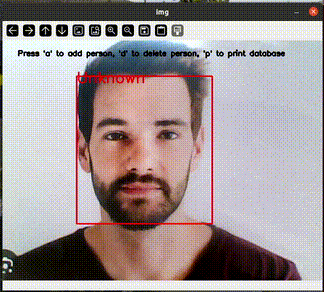

# 🔍Real-Time Face Detection and Recognition 

This project demonstrates **real-time face detection and recognition** using a **quantized TFLite model**  with **TensorFlow Lite** and **OpenCV**.

Designed for cross-platform use (Linux, Windows, embedded boards like NXP i.MX8M Plus), it supports **hardware acceleration** via delegates like **NPU or GPU**.

---



---

## 📁 Project Structure

```
.
├── face_database.py                  # Handles storing and finding faces
├── face_detection.py                 # Detects faces in images
├── face_recognition.py               # Creates face features for recognition
├── main.py                           # Main face detection and recognition script  
├── facenet_512_int_quantized.tflite  # Quantized TFLite model 
├── yoloface_int8.tflite              # Quantized TFLite model 
├── README.md                         # This documentation
```

---

## 🧠 Model Information

**Face Detection Model**

- **Model**: YOLO Detection Model (Quantized)  
- **Format**: TensorFlow Lite (`.tflite`)  

**Face Recognition Model**

- **Model**: Facenet Model (Quantized)  
- **Format**: TensorFlow Lite (`.tflite`) 

✅ Optimized for edge devices  
🧠 Compatible with NPU delegate (`libvx_delegate.so`) on platforms like i.MX8MP

---

## ✅ Dependencies

Install with:

```bash
pip install opencv-python tflite-runtime 
```

### Requirements:
- Python 3.6+
- OpenCV – for video stream processing and display
- TFLite Runtime – for inference

### 🔎 Note  
The `opencv-python` package automatically installs the latest version of **NumPy** that is compatible with your Python version.  
However, this program (or one of its dependencies) requires **NumPy version 1.x**, because modules compiled against NumPy 1.x may crash when used with NumPy 2.x or later.

To fix this issue, downgrade NumPy by running:  
```bash
pip install "numpy<2.0"
```
---

## 🚀 How to Run

### 1️⃣ Run with CPU:

```bash
python main.py
```
### 2️⃣ Run with NPU/GPU delegate:

```bash
python main.py -d path/to/libvx_delegate.so
```

> ✅ Ensure `libvx_delegate.so` exists on your device.

### 3️⃣ Use a different camera or video file:

```bash
# Use camera index X
python main.py -i X

# Use a video file
python main.py -i path/to/video.mp4
```
---

## 🎯 Output

- 🔲 Detected face region(s) highlighted with red bounding boxes on each frame.
- 🧠 Recognized face name (if matched in database) displayed above the bounding box.
- 🧾 Instruction message shown at the top: "Press 'a' to add person, 'd' to delete person, 'p' to print database"
- 🔤 Name input overlay UI appears when you press 'a' or 'd', letting you type a person's name.
- 💾 database.npy file is created and updated locally to store facial embeddings.
- 📝 If you press 'p', all known names in the database are shown at the top of the video feed until a key is pressed.
- ❌ If no face is detected, the face is not added and no name is shown.

### 🖼️ Display

- Live video window titled "img" shows detected faces with red boxes and recognized names in real time.
- At the top of the frame, a tip line shows: "Press 'a' to add person, 'd' to delete person, 'p' to print database"
- When 'a' or 'd' is pressed, a text input bar appears at the top to enter the person's name.
- When 'p' is pressed, a list of all known names is displayed on screen until a key is pressed.
- If the face is not recognized or doesn't match the database, "Unknown" is displayed above the bounding box.
- Press Ctrl+C in the terminal to quit the program and close the window.

---

## ⚙️ Internal Processing Flow

1. Initialize video source (camera or file)
2. Load TFLite face detection and recognition models (with or without delegate)
3. Initialize face embedding database from file or create empty database
4. Capture frame from video source
5. Detect faces in the frame using the face detector model
6. Extract face regions (ROIs) and apply padding
7. Generate 512-D embeddings for each face ROI using the recognizer model
8. Compare embeddings with database entries to find matching names
9. Display bounding boxes and recognized names on video frames
10.  Handle user input: 'a' to add new person, 'd' to delete person, 'p' to print database
11.  Repeat processing frames until program exit

---

## 💡 Tips

- ✅ Use **quantized models (uint8)** for better hardware compatibility
- 🚀 For NXP i.MX8MP, use **`libvx_delegate.so`** to run on the NPU
- 📏 Adjust input size/resolution to balance accuracy and performance
