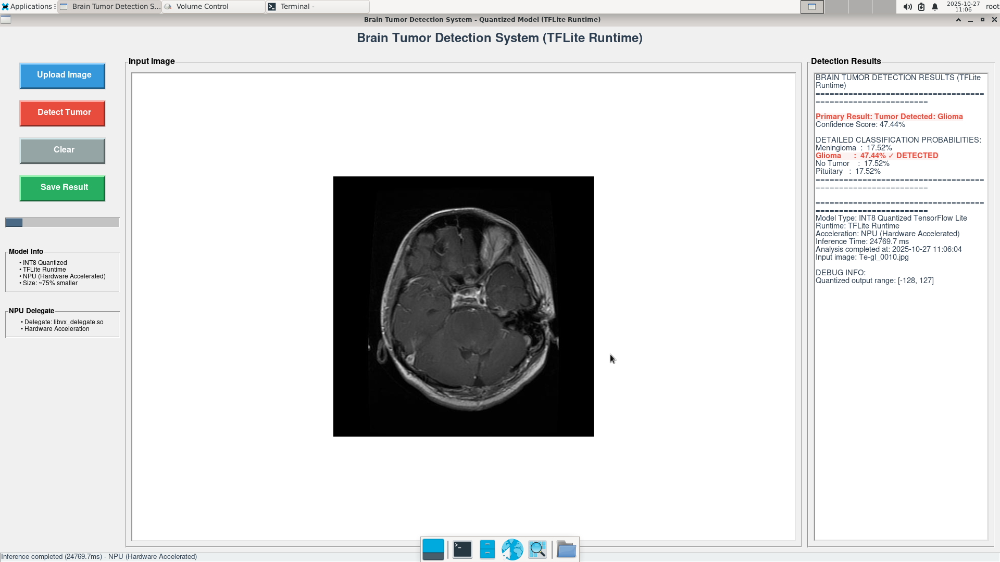

# 🧠 Brain Tumor Detection System

### **Quantized TensorFlow Lite with NPU Acceleration**

A **real-time brain tumor detection system** using **fully quantized TensorFlow Lite (INT8)** models optimized for **embedded hardware acceleration**.
The application performs **efficient inference on NPUs** with automatic **CPU fallback**, and includes a **GUI interface** for MRI classification results.

---




---

## 🚀 Overview

This project enables **low-latency and low-power brain tumor classification** from MRI images on ARM-based edge devices such as **phyBOARD-nash i.MX93**, **phyBOARD-pollux i.MX 8M plus**, and similar embedded platforms.

---

## 🧩 Features

* ⚙️ **INT8 Fully Quantized Model** (optimized for edge)
* ⚡ **NPU Delegate Support** (hardware acceleration)
* 🧠 **4-Class Tumor Classification** (Meningioma, Glioma, Pituitary, No Tumor)
* 🖥️ **Lightweight GUI Interface** (Tkinter + OpenCV + Pillow)
* 🔄 **Automatic Fallback to CPU** if delegate not available
* 📊 **Detailed Result Reporting** (confidence, inference time, quantization info)

---

## 🧠 Model Information

| **Parameter**           | **Specification**                           |
| ----------------------- | ------------------------------------------- |
| **Model Type**          | INT8 Fully Quantized TensorFlow Lite        |
| **Input Format**        | UINT8                                       |
| **Output Format**       | INT8                                        |
| **Input Quantization**  | Scale = 0.0039215689, Zero Point = 0        |
| **Output Quantization** | Scale = 0.00390625, Zero Point = -128       |
| **Classes**             | 4 (Meningioma, Glioma, No Tumor, Pituitary) |
| **Model Size**          | ~75% smaller than FP32 version              |

---


## 🧰 Dependencies

### **Core Requirements**

```bash
tflite-runtime >= 2.13.0
python >= 3.11
numpy == 1.26.4
```

### **GUI & Image Processing**

```bash
tkinter  # included with Python
Pillow >= 9.0.0
opencv-python >= 4.8.0
```

### **Installation**

```bash
# TFLite Runtime (for ARM64 or embedded devices)
pip install tflite-runtime

# Image and array processing
pip install opencv-python==4.8.1.78 Pillow==10.0.1 numpy==1.26.4
```

---

## 🖥️ How to Run

### **1. CPU-Only Execution**

```bash
python app.py
# or specify a model path
python app.py --model /path/to/model.tflite
```

### **2. NPU-Accelerated Execution**

```bash
# Example: IMX93 with NPU delegate
python app.py -d /usr/lib/libvx_delegate.so

# With custom model path
python app.py -d /usr/lib/libvx_delegate.so --model custom_model.tflite
```

### **Command Line Arguments**

| Flag               | Description                       |
| ------------------ | --------------------------------- |
| `-d`, `--delegate` | Path to NPU delegate library      |
| `--model`          | Path to quantized `.tflite` model |
| `-h`, `--help`     | Show help and usage instructions  |

---

## 📸 Output Example

```
BRAIN TUMOR DETECTION RESULTS (TFLite Runtime)
============================================================
Primary Result      : Tumor Detected → Glioma
Confidence Score    : 87.45%

DETAILED CLASSIFICATION PROBABILITIES
------------------------------------------------------------
Meningioma  :   5.23%
Glioma      :  87.45% ✓
No Tumor    :   3.12%
Pituitary   :   4.20%

------------------------------------------------------------
Model Type          : INT8 Quantized TensorFlow Lite
Runtime             : TFLite Runtime 2.13.0
Acceleration Mode   : NPU (Hardware Accelerated)
Inference Time      : 12.3 ms
Timestamp           : 2025-10-27 11:57:23
Input Image         : brain_scan_001.jpg
============================================================
```

---

## 🧬 Internal Processing Pipeline

### **1. Model Initialization**

```
Load Quantized TFLite Model → Try NPU Delegate → CPU Fallback → Extract Quantization Params
```

### **2. Image Preprocessing**

```
Input Image (RGB) → Resize (224×224) → Normalize [0,1] → Quantize (UINT8) → Add Batch Dimension
```

### **3. Inference**

```
UINT8 Input → NPU/CPU Inference → INT8 Output → Dequantize → Softmax → Probabilities
```

### **4. Post-Processing**

```
Softmax → ArgMax → Confidence Score → Class Mapping → GUI Output
```

### **5. Hardware Flow**

```
Check Delegate → Load Delegate → Allocate Tensors → Run Inference → CPU Fallback if Error
```

---


## 🧱 Robustness & Error Handling

* ✅ Automatic NPU → CPU fallback on delegate load failure
* ✅ Input format validation & error-safe preprocessing
* ✅ Optimized memory management for embedded devices
* ✅ Detailed runtime logs & user-friendly GUI feedback


