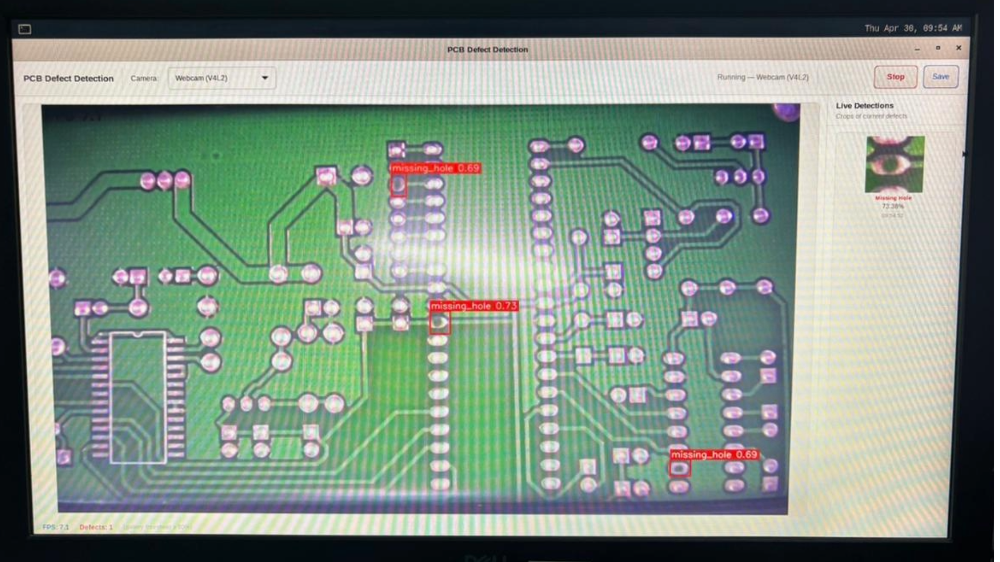

# 📌 PCB Defect Detection (YOLOv8 TFLite + NPU)

A lightweight **real-time PCB defect detection system** built using a **YOLOv8 TFLite (INT8 quantized) model** with optional **NPU acceleration**.

This project provides a **GTK3-based GUI** for live inference, supporting both **USB webcam (V4L2)** and **VM-016 CSI camera (GStreamer)**.

It detects common PCB defects such as:

* Missing hole
* Mouse bite
* Open circuit
* Short
* Spur
* Spurious copper

The application also displays:

* Live bounding boxes
* FPS performance
* Detected defect crops (confidence ≥ 60%)

---

## 🖼️ Output Example

> Replace with your actual screenshot





---

## 📂 Project Structure

```
.
├── best_saved_model/
│   └── pcb_defect_detection_yolov8n_full_integer_quant.tflite
├── pcb_defect_detection.py
└── README.md
```

---

## 🤖 Model Information

* **Model Type:** YOLOv8 (Object Detection)
* **Format:** TensorFlow Lite (INT8 Fully Quantized)
* **Input Size:** Dynamic (auto-resized using letterbox)
* **Acceleration:**

  * ✅ NPU (via `libvx_delegate.so`)
  * ✅ CPU fallback

### Supported Classes

* `missing_hole`
* `mouse_bite`
* `open_circuit`
* `short`
* `spur`
* `spurious_copper`

### Important Note ⚠️

This project is based on **YOLO architecture**, and **NPU drivers support is available only in PD24 Yocto version**.

---

## 📦 Dependencies

Make sure the following versions are installed:

```
gtk3+           3.24.41
numpy           1.26.4
tflite_runtime  2.15.0
opencv-python   4.9.0
```

---

## ▶️ How to Run

### 1. Install Dependencies

```bash
pip install numpy==1.26.4 opencv-python==4.9.0 tflite-runtime==2.15.0
```

GTK3 should be installed via system packages:

```bash
sudo apt install libgtk-3-dev
```

---

### 2. Run the Application

```bash
python3 pcb_defect_detection.py
```

---

### 3. Select Camera Mode

The application supports two modes:

#### 📷 Webcam (V4L2)

* Default USB camera
* No special setup required

#### 📷 VM-016 (CSI Camera)

* Uses GStreamer pipeline
* Requires **overlay configuration enabled**

👉 Ensure CSI camera is properly configured in your system before running.

---

### 4. Controls

* **Start** → Begin inference
* **Stop** → Stop detection
* **Save** → Capture current frame

---

## ⚙️ Features

* Real-time PCB defect detection
* GTK3 GUI with clean white theme
* NPU acceleration support (fallback to CPU)
* Live FPS monitoring
* Detection crop gallery
* Multi-camera support (USB + CSI)


