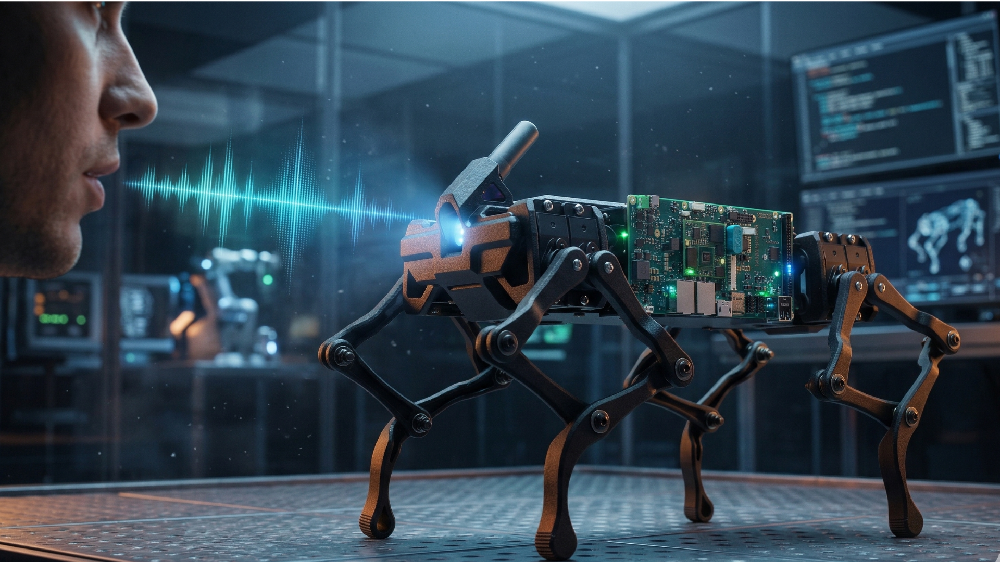
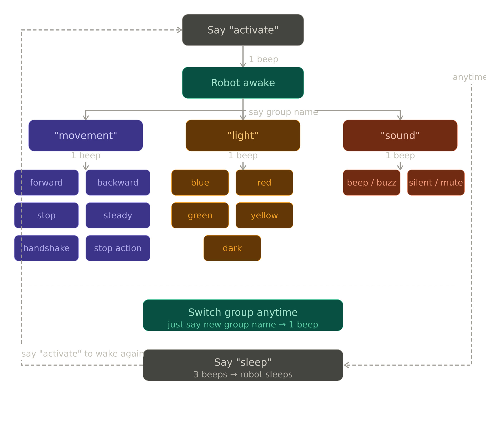

# 🐕 Edge AI Voice Control Quadruped Robot Dog

A real-time **Edge AI–powered voice control system** for a quadruped robot dog.
This project uses **offline speech recognition (Vosk)** running directly on an embedded device (**phyBOARD-Pollux**) to control robot movement, lighting, and sound — **no cloud required**.

The system is designed for **low-latency, reliable, and privacy-preserving control**, making it ideal for Edge AI demos and robotics applications.

---

## 📸 Output



---
## 🧠 Project Overview

* 🎙️ Voice-controlled robot using **offline AI**
* ⚡ Runs entirely on edge device (no internet)
* 🔄 Command groups:

  * Movement
  * Light
  * Sound
* 🔊 Audio feedback using buzzer
* 🔌 Serial communication with robot hardware
* 🔁 Hot-plug support for microphone

---

## 📁 Project Structure

```
.
├── main.py
├── robotic_dog.service
└── vosk-model-small-en-in-0.4
    ├── am
    │   └── final.mdl
    ├── conf
    │   ├── mfcc.conf
    │   └── model.conf
    ├── graph
    │   ├── Gr.fst
    │   ├── HCLr.fst
    │   └── phones
    │       └── word_boundary.int
    ├── ivector
    │   ├── final.dubm
    │   ├── final.ie
    │   ├── final.mat
    │   ├── global_cmvn.stats
    │   ├── online_cmvn.conf
    │   └── splice.conf
```

---

## ⚙️ Model Information

* **Model:** Vosk Speech Recognition (`vosk-model-small-en-in-0.4`)
* **Type:** Offline ASR (Automatic Speech Recognition)
* **Language:** English (India)
* **Sampling Rate:** 16 kHz
* **Key Features:**

  * Lightweight and edge-friendly
  * No internet dependency
  * Supports partial + final decoding
  * Robust to noisy environments

---

## 🧩 System Architecture

* 🎤 Microphone → Audio Capture (`arecord + sox`)
* 🧠 Vosk Model → Speech-to-text
* 🔍 Fuzzy Matching → Command Detection
* ⚙️ Command Execution → Serial Communication (`/dev/ttyUSB0`)
* 🤖 Robot → Executes movement / LED / buzzer

Core implementation: 

---

## 🗂️ Voice Command Groups

---

## 🎯 Wake & Control Flow

1. Say **"activate"** → robot wakes up 🔔
2. Say group name:

   * `movement`
   * `light`
   * `sound`
3. Give commands inside group
4. Switch groups anytime
5. Say **"sleep"** → robot deactivates 🔕

---

## 📦 Dependencies

Install required Python packages:

```bash
pip install vosk pyserial
```

System dependencies:

```bash
sudo apt install sox alsa-utils
```

---

## ▶️ How to Run

### 1️⃣ Hardware Setup

* Connect **WaveShare Robot Dog** to:

  * phyBOARD-Pollux via **USB (Serial)**
* Verify serial:

```bash
ls /dev/ttyUSB0
```

---

### 2️⃣ Microphone Setup

* Connect USB microphone
* Check available devices:

```bash
arecord -l
```

* Update in `main.py`:

```python
MIC_DEVICE = "sysdefault:CARD=YOUR_MIC_NAME"
```

---

### 3️⃣ Run Application

```bash
python3 main.py
```

---

## 🔔 Audio Feedback

* ✅ **1 Beep** → Wake / Group switch
* 🔕 **3 Beeps** → Sleep

---

## 🚀 Features

* ✔️ Fully offline AI system
* ✔️ Real-time voice control
* ✔️ Robust fuzzy command matching
* ✔️ Modular command groups
* ✔️ Edge-device optimized
* ✔️ Plug-and-play microphone handling

---

## 💡 Use Cases

* Edge AI demonstrations
* Robotics control systems
* Smart embedded interfaces
* Industrial automation demos
* Human-machine interaction research

---
